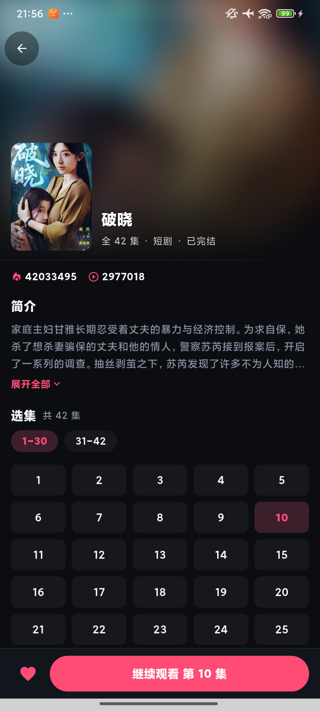
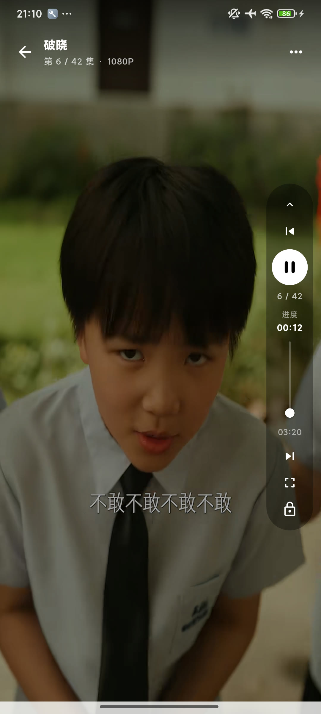
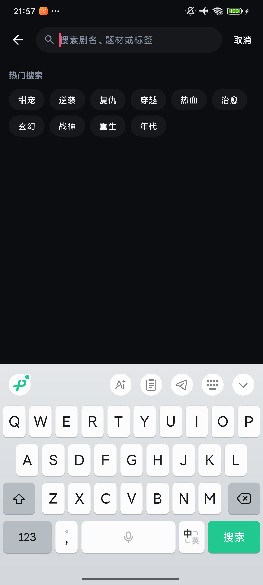
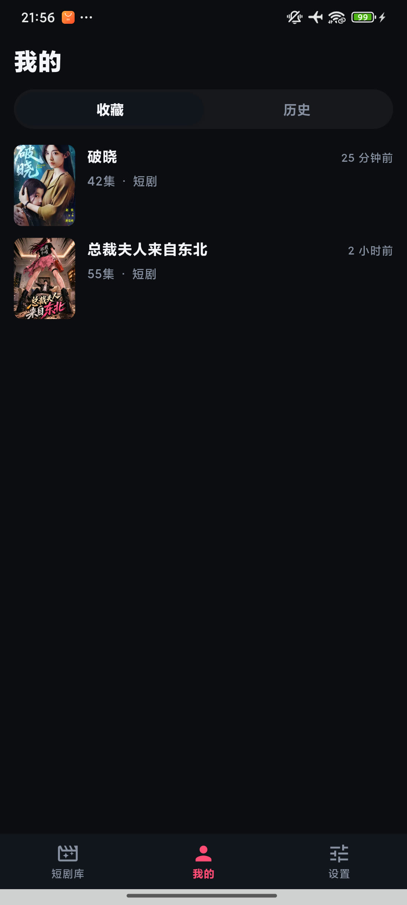

# onedrama

[English](README.md) | **中文**

自用短剧客户端。Flutter 画 UI，Kotlin 侧只持有播放器与纹理，协议层是上游协议的 Dart 重写。
v1 只接一个来源（红果），目标是能稳定播、自己天天刷。**不是**红果的克隆：没账号、没广告、
不做像素级仿官方 UI。

三件事足够不显然，值得先说清楚：

- **播放页在客户端解密。** 上游视频的每个样本都是 AES-128-CTR 加密的，**连 NAL 长度前缀
  都是密文**，所以现成的解封装器连容器都解析不了。从源码排除了 `media3` 的 `Mp4Extractor`，
  改成写一个解密数据源，由 Dart 侧从 `moov` 建出的样本索引驱动。拖进度条是准的，
  `STATE_READY` 落在约 2.3 s，而不是等整集下完。
- **取流有三档**（签名 App 接口 → 公开网页 → 第三方备用源），逐档回退。
- **协议有两份**——Go 参考实现与 Dart 移植——用共享 fixtures 双向比对，不会静默地分叉。

状态：v1.0.0 能构建、已签名、在真机上逐条核对过。APK 不外发。只建了 Android，没有 iOS /
桌面目标。

## 截图

| 短剧库（浅色） | 详情页（深色） | 播放页 |
| :--: | :--: | :--: |
|  |  |  |
| **榜单（深色）** | **搜索（深色）** | **我的（深色）** |
|  |  |  |

都是真机截图，来源见 [`docs/shots/README.md`](docs/shots/README.md)。
深浅两套主题在设置里切。

## 构建与运行

前置：Flutter **3.47.5 stable**（Dart 3.13.4）、JDK 17、Android SDK（minSdk 24 / targetSdk 36）、
Go **1.24.1+**（只跑协议参考实现的自检时需要）。本机实测可用的是 Flutter 3.47.5 / Go 1.27.1。

```bash
# 依赖。根项目这一条会把 path 依赖 packages/hongguo_dart 一起解出来。
flutter pub get

# 真机 / 模拟器
flutter devices
flutter run
```

出 release 包：

```bash
flutter build apk --release      # → build/app/outputs/flutter-apk/app-release.apk，通用包，约 55 MB
```

四处环境相关的坑，都写在代码里了，换台机器会撞上：

- `flutter` / `dart` 不在**当前** shell 的 PATH（Scoop 装的话新终端才有），脚本里用全路径。
- **构建目录被重定向到了仓库根的 `build/`**（`android/build.gradle.kts` 改的 `rootProject.layout.buildDirectory`），
  所以 Gradle 的产物不在 `android/app/build/` 里。
- `android/settings.gradle.kts` 要求 `android/local.properties` 里有 `flutter.sdk`。那个文件是
  gitignore 的，由 Flutter 工具生成——**所以别绕开 Flutter 直接跑 `gradlew`**，先 `flutter pub get` 一次。
- 构建脚本里留了两处本机网络环境的绕行：Maven 走**阿里云镜像优先**（`maven.google.com` 在那台机器上不可达），
  以及关掉 Kotlin 增量编译（AGP 9.1 + Kotlin 2.4 在 Windows 上稳定报
  `Storage is already registered`）。前者对别人无害，后者只是让构建慢一些。

### 签名

`android/key.properties` 与 `android/app/onedrama-release.p12`，**两者都在 `.gitignore` 里，
不在本仓库**。`android/app/build.gradle.kts` 读前者，**文件缺失就退回 debug 签名**——所以没拿到
密钥的人也跑得动 `flutter build apk --release`，不会因为缺文件而构建失败。

> ⚠️ 这两个文件必须另外备份。丢了就签不出同一个包，届时装新版本只能先卸载——而卸载会清掉
> 本地的收藏 / 历史 / 观看进度（`CONTEXT.md` 里这三样都是本地、不同步的）。设备没 root，导不回来。

## 自检

四条都跑过，全绿（Go 与两个 Dart 测试套件）：

```bash
cd hongguo && go test .              # ok hongguo —— 签名向量、SM3、ID 与剧集映射
cd packages/hongguo_dart && dart test # 32 passed, 7 skipped —— 契约测试
flutter test                          # 19 passed —— 格式化、解密计划往返、封面预取、页面转场
flutter analyze                       # No issues found
```

那 7 条跳过的跳过是**默认行为**，不是失败：它们是联网冒烟，真的去打上游接口。
这是「签名是否被服务端接受」的唯一硬证据——契约测试只能保证 Dart 和 Go 一致，两边一起错只有它会红：

```bash
cd packages/hongguo_dart && LIVE=1 dart test test/live_test.dart
```

Go 那边的联网接口需要真实站点，没做成单测。

## 目录与架构

```
onedrama/
├── lib/                       Flutter 应用（约 7.7k 行）
│   ├── data/                  网络（in-flight 去重 + TTL 缓存；取流一律不缓存）、
│   │                          sqflite 三张表（drama_snapshots / favorites / watch_progress）、
│   │                          设置与 DeviceID、Riverpod providers
│   ├── player/                CencPlayer（MethodChannel）、moov 头部解析、解密计划的编解码
│   └── ui/                    短剧库 / 榜单 / 详情 / 播放 / 搜索 / 我的 / 设置 / 首页壳 + 组件
├── packages/hongguo_dart/     协议层（约 3.8k 行）+ tool/ 离线验证脚本（约 1k 行）
├── hongguo/                   Go 参考实现（约 2.4k 行），不进 APK
├── android/                   Android 壳 + 两个 Kotlin 文件（约 494 行）
├── docs/adr/                  决策记录：为什么这么选
├── docs/plan.md               实施计划 + 真机逐条验证的日志（阶段 0 → 4c）
├── docs/shots/                README 截图
└── CONTEXT.md                 领域词表：Drama / Episode / Media / Heat / Rating 的定义
```

数据通路，两级各自回退：

```
目录 / 详情
  App 签名接口  ──失败──▶  网页  (解析 _ROUTER_DATA)

取流
  App 签名接口  ──失败──▶  网页 /player/{series}/{vid}  ──失败──▶  第三方备用源
```

分集地址是占位符 `hongguo-cenc://{vid}`，真正的流地址要再调一次取流才有。

## 三处不显然的地方

### 1. 在客户端按 CENC 规则解密，而不是交给 ExoPlayer 的 DRM

上游给的是**一把 16 字节裸密钥**，不是许可证服务器返回的密钥响应，官方 `video_player` 接不到。
更麻烦的是每个视频样本**整段** AES-128-CTR 加密、**连 NAL 长度前缀都是密文**，而 `media3` 的
`Mp4Extractor` 在 length-prefixed NAL 上无条件转 Annex-B、读源码确认没有任何加密分支，
于是把密文当长度读，抛 `Invalid NAL length`。补 `pssh`、走 ClearKey 都改变不了这一点。

**结论**：Dart 侧解析 `moov` 建样本索引与 IV，Kotlin 侧做解密数据源，按样本解出来再喂给
ExoPlayer；同时把 `moov` 里的加密盒子换成**等大的 `free` 盒子**（`encv` → `avc1` 原地改名），
总长不变、`stco` 偏移一个都不用重算。**任意字节位置都能从对应 counter 块起算，所以拖进度条是对的。**
这一点正是它比「先下载整集再解」强的地方。

→ [`docs/adr/0005`](docs/adr/0005-client-side-cenc-decryption.md)（含实测形态与踩过的坑）、
[`docs/adr/0002`](docs/adr/0002-thin-exoplayer-plugin-owns-cenc.md)（Kotlin 侧零 UI 的边界，已被 0005 部分取代）

### 2. 取流三级全搬，包含第三方备用源

后两级经常返回**明文流**，这正好是解密一路出问题时的兜底，所以三级都搬。
代价是第三方域名能看到你请求了哪一集——这条路**只在这个 APK 不外发的前提下成立**。

→ [`docs/adr/0004`](docs/adr/0004-all-three-media-resolution-paths.md)

### 3. 两份实现，用共享 fixtures 防静默分叉

协议在 Dart 里重写了一份（Go 版返回 `map[string]any`，gomobile 导不出，改 JSON 门面或 FFI
都要在 Windows 上配 NDK），于是从那一刻起就有两个真相。**签名写错的表现是真机上「搜不到剧」，
而不是测试红**——这是最坏的一类错误。所以真实响应（App JSON、网页 HTML、备用接口）存成 fixtures，
Go 和 Dart 各跑一遍解析并断言两端输出相等；签名、SM3、密钥还原用固定向量。Go 改一行，Dart 测试立刻红。

→ [`docs/adr/0001`](docs/adr/0001-dart-rewrite-instead-of-gomobile.md)、
[`docs/adr/0003`](docs/adr/0003-go-package-as-protocol-truth-with-fixtures.md)

### 决策索引

| # | 决策 |
| --- | --- |
| [0001](docs/adr/0001-dart-rewrite-instead-of-gomobile.md) | 协议在 Dart 里重写，而不是把 Go 编进 APK |
| [0002](docs/adr/0002-thin-exoplayer-plugin-owns-cenc.md) | 薄 Android 插件承载 ExoPlayer 与 CENC，控件全在 Flutter（已被 0005 部分取代） |
| [0003](docs/adr/0003-go-package-as-protocol-truth-with-fixtures.md) | Go 包留在仓库里当协议真相，用共享 fixtures 双向比对防分叉 |
| [0004](docs/adr/0004-all-three-media-resolution-paths.md) | 取流三级全搬，包含第三方备用源 |
| [0005](docs/adr/0005-client-side-cenc-decryption.md) | 在客户端按 CENC 规则解密，而不是交给 ExoPlayer 的 DRM |
| [0006](docs/adr/0006-sqflite-instead-of-drift.md) | 用 sqflite 而不是 drift 做本地存储（drift 走的 native assets 要从 github 拉预编译库，那台机器不通） |
| [0007](docs/adr/0007-detail-rating-from-web-detail.md) | 评分只能从网页详情拿，代价是详情页多发一次网页请求 |

## 许可

**开源，禁止商用。** 本仓库源码可用于个人学习与研究，**禁止任何形式的商业使用**。
仓库没有宽松许可证文件，条款即本节所述。

仓库里的上游接口实现（签名 / 取流 / 解析）只用于协议研究与互操作性验证，不构成任何形式的授权。
本项目不隶属于红果，也不分发上游的任何内容。截图中的剧集封面与正片画面版权归其各自权利人。

## 已知限制

- **上游协议随时可能改。** 网页 `_ROUTER_DATA` 的结构一变，分类 / 搜索 / 榜单会一起挂（fixtures 能让它测红）。
- **第三方备用播放域名不稳定**，密钥版本升级会直接失败。它只是兜底，挂了不影响主路。
- **约 40% 的剧本来就没有评分。** 评分只存在于网页详情里，App 接口没有这个字段，缺失是正常的、不是失败。
- **只在一台真机上逐条核对过**（Redmi `23013RK75C`，Android 15 / HyperOS），其它机型没验。
- **只有 Android。** 没建 iOS / 桌面工程。
- **不发 APK。** 见上面的许可与 ADR-0004。

## 文档导航

| 想了解 | 去哪 |
| --- | --- |
| 某个词到底指什么（Drama / Episode / Media / Heat / Rating…） | [`CONTEXT.md`](CONTEXT.md) |
| 为什么是这么选的 | [`docs/adr/`](docs/adr/) |
| 怎么一路验过来的（含每个坑的实测记录） | [`docs/plan.md`](docs/plan.md) |
| 上游协议本身的细节（ID 约定、站点常量、Client API） | [`hongguo/README.md`](hongguo/README.md) |
